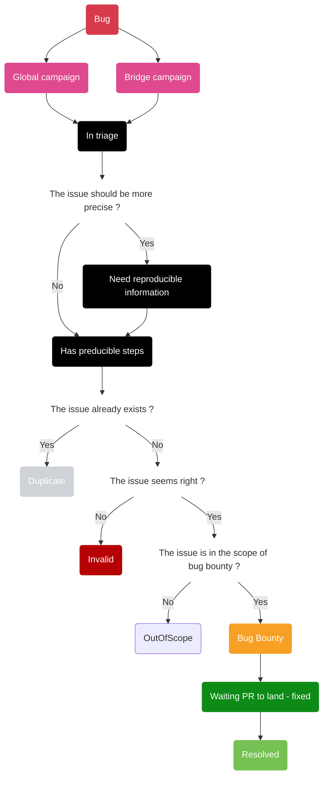

# Archethic Community Bug Bounty Program

## Description of the Program

**Archethic is a Layer 1 blockchain protocol**. We have innovated multiple aspects of the blockchain design to achieve scale, security, sustainability, and simplicity without foregoing the core tenet of decentralization. All these innovations have been thoroughly researched and they are now being implemented. Any such innovation takes time due its complexity. Moreover, the absence of similar architecture makes it difficult to assess, benchmark and validate.  
**We are launching the bug bounty program** to involve our community in this effort **to deploy a truly decentralized ecosystem** that is ready for mass adoption. There would be another phase of bounty program in future, which will be launched after stabilization. To test and validate the network, we would be launching the code on real mainnet nodes. Unlike other bug bounty programs, our community would be testing the stability and functionality of the real mainnet nodes. This means that even though it is the mainnet, we would be resetting the nodes, if required. Since the tokens are still not migrated to this network there is no risk of loss. The tokens available on this network would be dummy tokens. Please expect disruption and loss of dummy tokens in case of a reset. Aim is to push the network to achieve the stability and security expected of a large-scale ecosystem.  
If you discover a bug, we appreciate your cooperation in responsibly investigating and reporting it to us so that we can address it as soon as possible. 
**The bug bounty program allows Archethic Foundation to recognise and reward members of the community for helping us find and address significant bugs**, in accordance with the terms of the bug bounty program. 

More information is available on [Archethic Blog](https://blog.archethic.net/bugbounty/)

## Issues

### Issue Workflow

The Github's labels system allows to follow the progress of the issue:

### Archethic ecosystem

Some labels prefixed by "p:" could be affected to an issue to precise the area of the issue

Example: 

